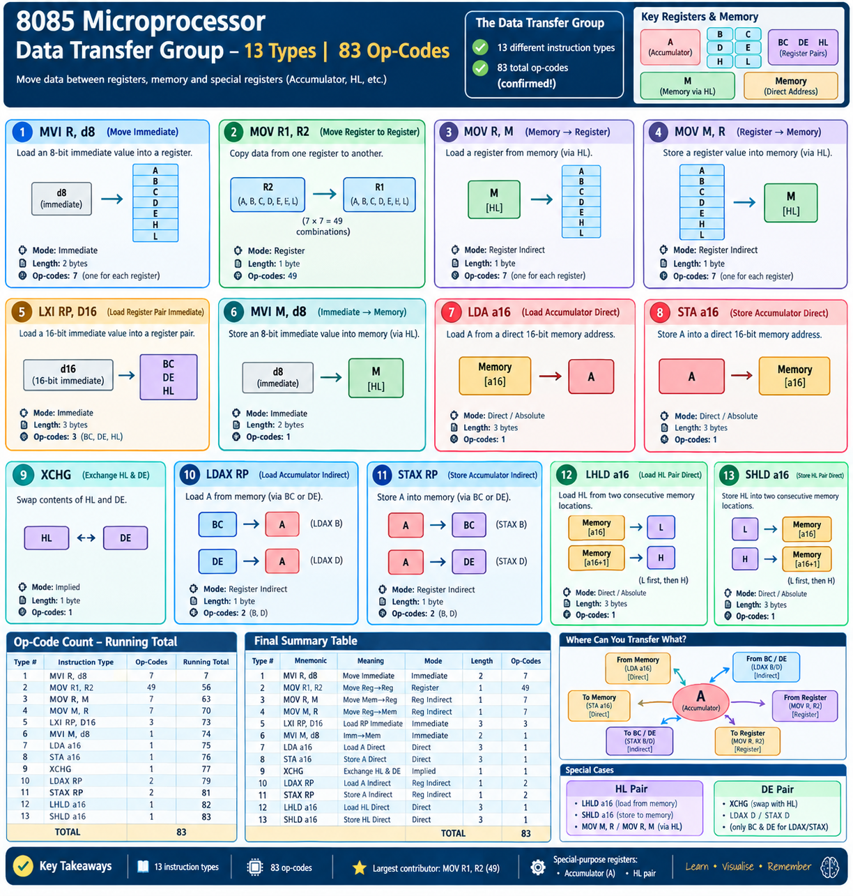

# 8085 Microprocessor — Summary of Data Transfer Group of Instructions

> A complete recap of all **13 instruction types** and **83 op-codes** covered under the **Data Transfer Group** of 8085 instructions. This session verifies the earlier claim: *13 types, 83 op-codes total.*

---

## Table of Contents
1. [Context](#context)
2. [All 13 Instruction Types — Recap](#all-13-instruction-types--recap)
3. [Op-Code Count — Running Total](#op-code-count--running-total)
4. [Final Verification Table](#final-verification-table)
5. [Session Summary](#session-summary)

---

## Context

The 8085 microprocessor has **7 groups of instructions**. This series has been covering the **first group: Data Transfer Instructions**, which contains:
- **13 distinct instruction types**
- **83 total op-codes** (specific instruction variants)

This session walks through each of the 13 types, recapping their meaning, addressing mode, and op-code count — and tallies them up to confirm the total of 83.

---

## All 13 Instruction Types — Recap

### Type 1: `MVI R, d8` — Move Immediate
- **MVI** = Move Immediate. Loads a register with an 8-bit value **sent directly within the instruction**.
- `R` can be any of: **A, B, C, D, E, H, L** → **7 registers**.
- **Addressing mode:** Immediate
- **Op-codes covered: 7**

### Type 2: `MOV R1, R2` — Move Register to Register
- **MOV** = Move. Loads destination register **R1** with the value from source register **R2**.
- R1 and R2 can each be any of the 7 registers (A, B, C, D, E, H, L), giving all combinations.
- **Addressing mode:** Register
- **Op-codes covered: 49**

### Type 3: `MOV R, M` — Move from Memory (via HL) to Register
- Loads register `R` with the 8-bit value from the memory location pointed to by the **HL register pair** (`M`).
- Source is always `M` (memory via HL); destination `R` can be any of 7 registers.
- **Addressing mode:** Register Indirect
- **Op-codes covered: 7**

### Type 4: `MOV M, R` — Move from Register to Memory (via HL)
- The **opposite** of Type 3: loads the memory location pointed to by HL with the 8-bit value from register `R`.
- Before execution, the **HL register pair must already contain the intended memory address**.
- **Addressing mode:** Register Indirect
- **Op-codes covered: 7**

### Type 5: `LXI RP, D16` — Load Extended Register Immediate
- **LXI** = Load Extended Register Immediate. Loads a **16-bit immediate value** directly into a register pair (RP).
- Covers **3 register pairs**: BC, DE, HL.
- **Addressing mode:** Immediate
- **Op-codes covered: 3**

### Type 6: `MVI M, d8` — Move Immediate to Memory (via HL)
- Loads the memory location pointed to by HL with an 8-bit immediate value (`d8`) given directly in the instruction.
- Only **one** variant exists (destination is always `M`).
- **Addressing mode:** Immediate
- **Op-codes covered: 1**

### Type 7: `LDA a16` — Load Accumulator (Direct)
- Loads the accumulator with the content of the memory location specified by the 16-bit address (`a16`), given directly in the instruction.
- Only **one** op-code — because the accumulator is a special-purpose register.
- **Addressing mode:** Direct/Absolute
- **Op-codes covered: 1**

### Type 8: `STA a16` — Store Accumulator (Direct)
- The **opposite** of Type 7: stores the accumulator's content into the memory location specified by `a16`.
- Only **one** op-code.
- **Addressing mode:** Direct/Absolute
- **Op-codes covered: 1**

### Type 9: `XCHG` — Exchange HL and DE
- Exchanges the contents of the **DE** and **HL** register pairs.
- The register pairs are never explicitly named in the instruction — the microprocessor infers the operation.
- Only **one** op-code.
- **Addressing mode:** Implied
- **Op-codes covered: 1**

### Type 10: `LDAX RP` — Load Accumulator Indirect
- Loads the accumulator from the memory location pointed to by a register pair (**BC** or **DE** only — not HL, since `MOV A, M` already covers that functionality).
- Two specific instructions: `LDAX B`, `LDAX D`.
- **Addressing mode:** Register Indirect
- **Op-codes covered: 2**

### Type 11: `STAX RP` — Store Accumulator Indirect
- The **opposite** of Type 10: stores the accumulator into the memory location pointed to by a register pair (**BC** or **DE** only — not HL, since `MOV M, A` already covers that functionality).
- Two specific instructions: `STAX B`, `STAX D`.
- **Addressing mode:** Register Indirect
- **Op-codes covered: 2**

### Type 12: `LHLD a16` — Load HL Pair (Direct)
- Loads the **HL register pair** from two consecutive memory locations, starting at the address specified by `a16`.
- The content at the given (starting) address loads into **L**; the content at the next consecutive address loads into **H**.
- Only works with the HL pair.
- Only **one** op-code.
- **Addressing mode:** Direct/Absolute
- **Op-codes covered: 1**

### Type 13: `SHLD a16` — Store HL Pair (Direct)
- The **opposite** of Type 12: stores the **HL register pair** into two consecutive memory locations, starting at the address specified by `a16`.
- The content of **L** is stored at the given (starting) address; the content of **H** is stored at the next consecutive address.
- Only works with the HL pair.
- Only **one** op-code.
- **Addressing mode:** Direct/Absolute
- **Op-codes covered: 1**

---

## Op-Code Count — Running Total

| Type # | Instruction Type | Op-Codes | Running Total |
|---|---|---|---|
| 1 | `MVI R, d8` | 7 | 7 |
| 2 | `MOV R1, R2` | 49 | 56 |
| 3 | `MOV R, M` | 7 | 63 |
| 4 | `MOV M, R` | 7 | 70 |
| 5 | `LXI RP, D16` | 3 | 73 |
| 6 | `MVI M, d8` | 1 | 74 |
| 7 | `LDA a16` | 1 | 75 |
| 8 | `STA a16` | 1 | 76 |
| 9 | `XCHG` | 1 | 77 |
| 10 | `LDAX RP` | 2 | 79 |
| 11 | `STAX RP` | 2 | 81 |
| 12 | `LHLD a16` | 1 | 82 |
| 13 | `SHLD a16` | 1 | **83** |

✅ **Confirmed: 13 instruction types → 83 total op-codes.**

---

## Final Verification Table

| Type # | Mnemonic | Meaning | Addressing Mode | Length | Op-Codes |
|---|---|---|---|---|---|
| 1 | `MVI R, d8` | Move Immediate | Immediate | 2 bytes | 7 |
| 2 | `MOV R1, R2` | Move Register to Register | Register | 1 byte | 49 |
| 3 | `MOV R, M` | Move Memory to Register | Register Indirect | 1 byte | 7 |
| 4 | `MOV M, R` | Move Register to Memory | Register Indirect | 1 byte | 7 |
| 5 | `LXI RP, D16` | Load Register Pair Immediate | Immediate | 3 bytes | 3 |
| 6 | `MVI M, d8` | Move Immediate to Memory | Immediate | 2 bytes | 1 |
| 7 | `LDA a16` | Load Accumulator Direct | Direct/Absolute | 3 bytes | 1 |
| 8 | `STA a16` | Store Accumulator Direct | Direct/Absolute | 3 bytes | 1 |
| 9 | `XCHG` | Exchange HL & DE | Implied | 1 byte | 1 |
| 10 | `LDAX RP` | Load Accumulator Indirect | Register Indirect | 1 byte | 2 |
| 11 | `STAX RP` | Store Accumulator Indirect | Register Indirect | 1 byte | 2 |
| 12 | `LHLD a16` | Load HL Pair Direct | Direct/Absolute | 3 bytes | 1 |
| 13 | `SHLD a16` | Store HL Pair Direct | Direct/Absolute | 3 bytes | 1 |
| | | | | **Total** | **83** |

---

## Session Summary

- The **Data Transfer Group** of 8085 instructions consists of **13 instruction types**, totaling **83 op-codes** — confirmed by tallying each type's contribution.
- The largest contributor by far is **`MOV R1, R2`** (49 op-codes), since it covers all combinations of 7 source and 7 destination registers.
- Several instruction types are restricted to **only 1 op-code** because they are specific to the **accumulator** (`LDA`, `STA`, `LDAX`/`STAX` excluding HL) or the **HL pair** (`LHLD`, `SHLD`), both of which are special-purpose in how they can be addressed.
- This completes the full study of the **Data Transfer Group** — the **first of 7 instruction groups** in the 8085 microprocessor.

---

*Next session: Solving practice problems using the Data Transfer instructions learned so far.*
